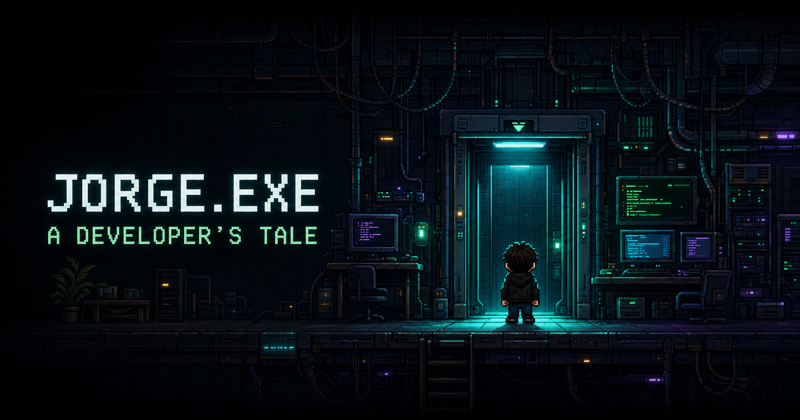

# JORGE.EXE — A Developer's Tale

Portafolio web interactivo de Jorge Colamarco presentado como una colección de dioramas narrativos 2D. Cada piso de JORGE LABS es una habitación compacta, viva y cinematográfica: la información importante aparece cerca, se reconoce por su composición y se abre sin recorridos de relleno. **Quick View** conserva una ruta HTML directa y accesible para consultar el mismo portafolio sin jugar.



## Qué incluye esta versión

- Portada `JORGE.EXE` iniciable con Enter, clic o toque.
- Introducción de ascensor con opción para omitirla.
- Mundo 2D construido con Phaser: movimiento, gravedad, colisiones, cámara contenida e interacción contextual.
- Cinco pisos conectados por un elevador global: `Q` lo llama desde cualquier punto y una transición de puertas acompaña el cambio de piso.
- Habitaciones tipo diorama con iluminación por capas, pantallas y movimiento ambiental discreto; los elementos flotantes sin función fueron eliminados.
- Objetos reales del escenario identificables por un pulso blanco que cambia a verde cuando la interacción queda activa. Se abren por proximidad con `E`/`Enter` o directamente con clic/toque.
- Lobby compacto cuyo único objeto interactivo es el ascensor físico; un cartel explica `E` por proximidad y `Q` desde cualquier punto.
- Laboratorio de proyectos con sets diferenciados para CarDrive, SHIKO y Comernova; interactuar abre directamente su expediente.
- Diálogos grandes superpuestos al escenario, con efecto de escritura, progreso visible y protección contra pulsaciones repetidas.
- Fichas HTML accesibles con descripción, problema resuelto, funciones, tecnologías, estado y acciones de proyecto.
- Biblioteca académica compacta con UEES, `Cambridge C1 Advanced · Statement of Results` verificable y la formación completada `AWS Academy Data Engineering Trained`.
- Sobre mí con ubicación real en Guayaquil y un método de trabajo orientado a comprender, simplificar y entregar. Chess.com vive exclusivamente en el tablero de ajedrez de la escena.
- Tablero de ajedrez con perfil público de [Chess.com](https://www.chess.com/member/jorcolito), Rapid, Tactics/Puzzle Rush cuando la API los expone y partidas recientes.
- Escena de contacto con retrato y sprite pixel-art creados a partir de una fotografía real de Jorge; abre correo, GitHub y LinkedIn sin formulario ficticio.
- Quick View compacto con presentación, proyectos, tecnologías animadas por área, credenciales, método de trabajo y contacto directo; no duplica Chess ni muestra contadores decorativos.
- Controles táctiles en pantallas pequeñas o dispositivos con puntero grueso.
- Navegación por teclado, foco visible, modales con control de foco y cierre con Escape.
- Preferencia de movimiento reducido, introducción omitible y audio desactivado de inicio.
- Diseño responsive con canvas 16:9 y paneles adaptados al viewport.
- Fallback HTML útil: Quick View no depende del canvas para presentar la información profesional.

El control de sonido está preparado en la interfaz y en el contrato del juego, pero el MVP todavía no reproduce música ni efectos. Tampoco existe persistencia de progreso, combate, backend de contacto o analítica.

## Arquitectura real

El proyecto conserva el starter **vinext/Vite** y su App Router compatible con Next.js. La experiencia combina React 19, TypeScript estricto y Phaser 3.90.

```text
app/page.tsx
  └─ JorgeExeExperience (estado y overlays React)
       ├─ StartScreen / Intro / Quick View / modales HTML
       └─ GameCanvas (cliente)
            └─ importación dinámica de src/game
                 └─ Phaser.Game + escenas + Arcade Physics

src/data ────────────────┬─ juego
                         └─ Quick View y modales

Chess.com PubAPI ──> app/api/chess ──> modal del tablero de ajedrez

React ── comandos tipados ──> GameBridge ──> Phaser
React <── eventos tipados ─── GameBridge <── Phaser
```

- **vinext + Vite:** desarrollo y build principal del starter, con integración de Sites/Cloudflare en `vite.config.ts`.
- **React:** controla portada, introducción, Quick View, diálogos, modales, preferencias y controles táctiles.
- **Phaser:** controla escenas, jugador, física, colisiones, cámara y zonas de interacción.
- **GameBridge:** transporta `ReactToGameCommand` y `GameToReactEvent` sin guardar un segundo estado de la aplicación.
- **Datos tipados:** `src/data/` alimenta tanto el juego como Quick View; los componentes no mantienen copias manuales.
- **Chess.com server-side:** `app/api/chess/route.ts` consulta la PubAPI en serie, normaliza los datos públicos y alimenta únicamente el modal invocado desde el tablero.
- **Carga segura:** Phaser se importa dinámicamente desde `GameCanvas`, por lo que no se evalúa durante renderizado de servidor.
- **Ciclo de vida:** abrir un modal pausa el mundo existente; no crea otra instancia del juego. Al desmontar, canvas, bridge y listeners se destruyen.

Educación, Sobre mí y Contacto reutilizan una escena parametrizada (`InfoFloorScene`); Lobby y Proyectos tienen escenas dedicadas. Cada escena mantiene su composición dentro de una sala corta, con objetos esenciales visibles o a pocos pasos.

## Prerrequisitos

- Node.js `>= 22.13.0`.
- npm compatible con la versión de Node instalada.
- Navegador moderno con Canvas/WebGL, módulos ES y Pointer Events.

El MVP no requiere variables de entorno, base de datos ni credenciales para ejecutarse. Una conexión de red permite cargar la actividad pública de Chess.com; si no está disponible, la sección muestra un fallback y el resto del portafolio funciona normalmente.

## Instalación y desarrollo

```bash
npm install
npm run dev
```

Abre la URL indicada por vinext en la terminal. Para detener el servidor, usa `Ctrl+C`.

## Comandos de validación

```bash
# Build vinext/Sites/Cloudflare
npm run build

# ESLint
npm run lint

# Build y pruebas de render/arquitectura
npm test

# Comprobación estricta de TypeScript sin emitir archivos
npx tsc --noEmit
```

| Comando | Propósito |
| --- | --- |
| `npm install` | Instala las versiones declaradas y actualiza el lockfile si corresponde |
| `npm run dev` | Inicia vinext/Vite en modo desarrollo |
| `npm run build` | Genera la salida vinext para el flujo Sites/Cloudflare |
| `npm run start` | Sirve la build vinext generada |
| `npm run lint` | Revisa el proyecto con ESLint |
| `npm test` | Ejecuta primero el build y luego las pruebas de `tests/rendered-html.test.mjs` |
| `npx tsc --noEmit` | Comprueba tipos sin generar JavaScript |

`npm test` vuelve a ejecutar el build; no es necesario correr ambos comandos seguidos salvo que se quiera registrar cada resultado por separado.

## Estructura principal

```text
app/
  api/chess/route.ts           # proxy con caché y fallback para Chess.com
  JorgeExeExperience.tsx    # orquestación de la experiencia y overlays
  globals.css               # tokens, pixel UI, responsive y accesibilidad
  layout.tsx                # metadata y shell HTML
  page.tsx                  # entrada de la aplicación
src/
  components/game/          # host de Phaser y controles táctiles
  components/ui/            # portada, intro, diálogos, Quick View y modales
  data/                     # perfil, proyectos, pisos y diálogos tipados
  game/config/              # creación y configuración de Phaser
  game/entities/            # texturas originales generadas por código
  game/events/              # bridge React–Phaser
  game/scenes/              # Lobby, Proyectos y pisos informativos
  game/types/               # eventos, comandos y contratos públicos
  lib/chess-com.ts           # normalización server-side de la PubAPI
  types/                    # modelos de contenido y enlaces discriminados
public/                     # favicon, Open Graph y fondos originales de escenas
docs/                       # visión, GDD, arquitectura, contenido y roadmap
tests/                      # pruebas sobre la build renderizada
worker/                     # entrada conservada del starter Sites/Cloudflare
vite.config.ts              # vinext + Vite + Cloudflare/Sites
next.config.ts              # ruta nativa de Next.js para Vercel
```

## Controles

### Escritorio

| Acción | Control |
| --- | --- |
| Mover izquierda | `A` o `←` |
| Mover derecha | `D` o `→` |
| Saltar | `W`, `↑` o `Espacio` |
| Interactuar | `E` o `Enter` |
| Llamar al elevador desde cualquier punto | `Q` |
| Avanzar/revelar diálogo | `E`, `Enter`, `Espacio` o botón Continuar |
| Cerrar modal | `Escape` o botón Cerrar |

También se puede abrir el elevador desde la barra superior y Quick View desde su botón HTML persistente.

### Móvil y tablet

- Mantener `←` o `→` para desplazarse.
- `↑` para saltar.
- `E` para interactuar.
- `Q` para llamar al elevador.
- Tocar Continuar para avanzar diálogos y los botones HTML para cerrar paneles.

Los controles táctiles aparecen por debajo de `760 px` o cuando el navegador informa un puntero grueso. Se deshabilitan mientras un diálogo o modal bloquea el juego.

## Datos tipados y disponibilidad de recursos

La aplicación no publica información ficticia. Correo, GitHub y LinkedIn ya tienen destinos reales; el Statement of Results de Cambridge y la insignia de AWS Academy están disponibles. CV, demos o repositorios no entregados conservan `availability: "placeholder"` y `href: null`, y sus acciones no se muestran como enlaces funcionales.

El modelo en `src/types/links.ts` es una unión discriminada:

```ts
type ResourceLink =
  | {
      availability: "available";
      href: string;
      // id, kind, label y ariaLabel
    }
  | {
      availability: "placeholder";
      href: null;
      placeholderMessage: string;
      // id, kind, label y ariaLabel
    };
```

Esto evita enlaces `#`, URLs vacías y botones que aparenten estar disponibles.

### Contacto y CV

Edita `CONTACT_LINKS` en `src/data/profile.ts`. Para cada recurso confirmado:

1. cambia `availability` a `"available"`;
2. sustituye `href: null` por la URL real;
3. elimina `placeholderMessage`;
4. actualiza `id`, `label` y `ariaLabel` para que ya no digan “pendiente”.

Ejemplo para correo:

```ts
{
  id: "contact-email",
  kind: "email",
  label: "correo@dominio.com",
  ariaLabel: "Enviar un correo a Jorge Colamarco",
  availability: "available",
  href: "mailto:correo@dominio.com",
}
```

Al mezclar enlaces disponibles y pendientes, cambia el tipo del arreglo:

```ts
import type {
  PortfolioProfile,
  ResourceLink,
  Technology,
  TechnologyCategory,
  TechnologyGroup,
} from "../types";

export const CONTACT_LINKS = [
  // ...
] as const satisfies readonly ResourceLink[];
```

Para el CV:

1. copia el PDF a `public/jorge-colamarco-cv.pdf`;
2. usa `kind: "cv"`, `availability: "available"` y `href: "/jorge-colamarco-cv.pdf"`;
3. ejecuta TypeScript, lint y build.

Quick View y el panel de contacto leen automáticamente los enlaces actualizados. Los destinos publicados actualmente son `mailto:jorgecolamarco03@gmail.com`, `github.com/jorcolito` y el perfil confirmado de LinkedIn; el CV continúa pendiente.

### Demos y repositorios de proyectos

Edita `links.demo` y `links.repository` del proyecto correspondiente en `src/data/projects.ts`. Se puede reemplazar cada llamada al helper de placeholder por un enlace disponible:

```ts
links: {
  demo: {
    id: "cardrive-demo",
    kind: "demo",
    label: "Ver demo",
    ariaLabel: "Abrir demo de CarDrive",
    availability: "available",
    href: "https://demo.example.com",
  },
  repository: {
    id: "cardrive-repository",
    kind: "repository",
    label: "Ver en GitHub",
    ariaLabel: "Abrir repositorio de CarDrive en GitHub",
    availability: "available",
    href: "https://github.com/usuario/repositorio",
  },
},
```

Usa URLs reales en lugar de los dominios del ejemplo. El cambio se refleja en la ficha del proyecto y en cualquier vista que consuma el mismo objeto tipado.

### Cambridge C1 y AWS Academy

La biblioteca se define en `EDUCATION_LIBRARY`, dentro de `src/data/education.ts`, y contiene tres registros: formación UEES, Cambridge C1 y AWS Academy.

- Cambridge se publica como **`Cambridge C1 Advanced · Statement of Results`**, con CEFR C1, overall score 180, Pass at Grade C y fecha de marzo de 2023.
- El archivo adjunto dice expresamente que no es el certificado formal; la interfaz y esta documentación conservan esa distinción.
- `AWS Academy Data Engineering Trained` se presenta como formación completada respaldada por su insignia. No se describe como certificación profesional de AWS ni se le atribuyen fecha o ID de credencial.
- No se infiere ninguna credencial ausente ni se rellenan volúmenes académicos ficticios.

La animación de apertura del libro y Quick View consumen la misma colección tipada, por lo que una actualización se refleja en ambas rutas.

Después de sustituir contenido:

```bash
npx tsc --noEmit
npm run lint
npm test
```

## Despliegue en Vercel

El código de `app/` también es una aplicación Next.js válida, pero el script `build` del repositorio ejecuta **vinext**, no `next build`. Vercel detecta y usa el script `build` cuando existe, así que el override es obligatorio para desplegar con su runtime nativo de Next.js.

### Desde el dashboard

1. Sube el repositorio a GitHub, GitLab o Bitbucket.
2. En Vercel, elige **Add New → Project** e importa el repositorio.
3. Usa la raíz del repositorio como **Root Directory**.
4. Selecciona **Next.js** como **Framework Preset**.
5. En **Build and Deployment**, activa **Override** para Build Command y escribe:

   ```bash
   npx next build
   ```

6. Usa `npm install` como Install Command o conserva el valor automático.
7. Deja **Output Directory** sin override; Vercel debe usar la salida predeterminada de Next.js. No configures `dist`.
8. Selecciona Node.js `22.x`, coherente con `engines.node >=22.13.0`.
9. No agregues variables de entorno para este MVP.
10. Pulsa **Deploy** y, al terminar, valida portada, inicio, Quick View, cambio de pisos y una ficha de proyecto.

Los futuros commits en la rama conectada generarán previews o despliegues de producción según la configuración del proyecto. Vercel documenta el override del build y la detección de frameworks en su [guía de configuración de builds](https://vercel.com/docs/builds/configure-a-build).

### Con Vercel CLI

Después de crear o configurar el proyecto con el build override anterior:

```bash
npx vercel link
npx vercel
npx vercel --prod
```

Si la CLI pregunta por la configuración, selecciona Next.js, usa `npx next build` y conserva la salida predeterminada. No aceptes `npm run build` para el proyecto Vercel, porque ese comando produce la variante vinext/Sites.

## Compatibilidad Sites/Cloudflare

El starter conserva su ruta original para Sites/Cloudflare:

- `npm run dev` y `npm run build` usan vinext/Vite.
- `vite.config.ts` registra `vinext()`, el plugin de Sites y `@cloudflare/vite-plugin`.
- `worker/index.ts`, `.openai/hosting.json` y `build/sites-vite-plugin.ts` permanecen disponibles.
- D1 y R2 están desactivados actualmente (`null`) y el portafolio no los necesita.
- Las pruebas renderizan la salida vinext desde `dist/server/index.js`.

| Destino | Build | Salida administrada por |
| --- | --- | --- |
| Sites/Cloudflare | `npm run build` | vinext/Vite + Worker de Cloudflare |
| Vercel | `npx next build` | runtime nativo de Next.js en Vercel |

No mezcles las salidas: `dist` pertenece al flujo vinext/Cloudflare y la salida Next pertenece al flujo Vercel.

## Documentación de diseño

- [`docs/PRODUCT_VISION.md`](docs/PRODUCT_VISION.md)
- [`docs/GAME_DESIGN_DOCUMENT.md`](docs/GAME_DESIGN_DOCUMENT.md)
- [`docs/TECHNICAL_ARCHITECTURE.md`](docs/TECHNICAL_ARCHITECTURE.md)
- [`docs/CONTENT_GUIDE.md`](docs/CONTENT_GUIDE.md)
- [`docs/ROADMAP.md`](docs/ROADMAP.md)

## Limitaciones actuales

- El CV y algunos enlaces de proyecto continúan pendientes; no se presentan como disponibles.
- Correo, GitHub, LinkedIn, el Statement of Results de Cambridge y la insignia de AWS Academy sí tienen recursos reales.
- No existe un formulario de contacto ficticio ni se simula un envío.
- La actividad de Chess.com depende de su API pública; el portafolio muestra un fallback si no está disponible y nunca inventa estadísticas.
- El control de audio no reproduce sonidos todavía.
- No existe memoria, punto de guardado ni persistencia de progreso.
- El retrato y el sprite de Contacto derivan de una fotografía real de Jorge; no se usa una persona genérica.
- Los fondos y recursos visuales son originales; las animaciones ambientales se construyen con capas ligeras de Phaser y CSS.
