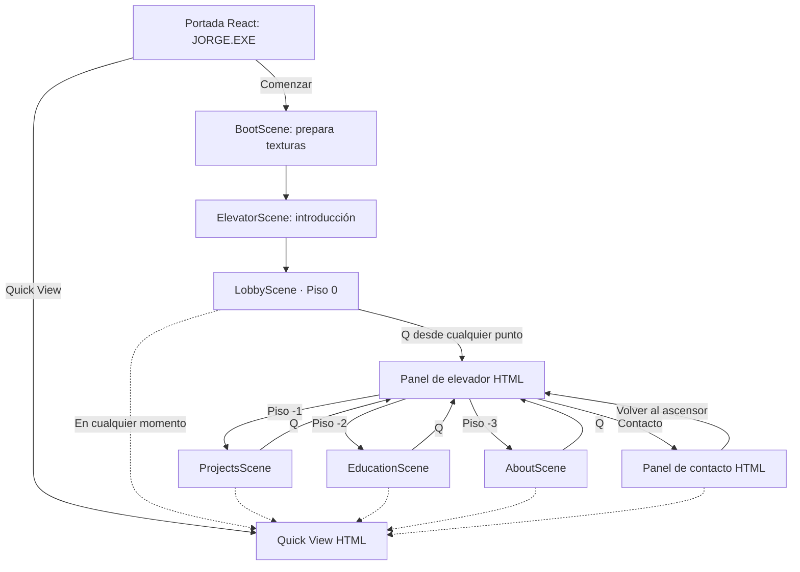

# Game Design Document — JORGE.EXE

**Versión:** Rediseño 3.0

**Género:** exploración narrativa 2D para web

**Duración objetivo:** 3–8 minutos para el recorrido principal; contenido opcional sin límite

**Perspectiva:** lateral con profundidad escénica, un diorama compacto por piso

**Riesgo o derrota:** ninguno

## Fantasía del jugador

El visitante entra a Jorge Labs, un estudio nocturno donde cada piso conserva una parte del trabajo y la historia de Jorge. No supera pruebas ni combate: observa una composición viva, se acerca a uno de sus focos y abre expedientes. El elevador global convierte la navegación del portafolio en parte del mundo sin obligarlo a regresar a una esquina.

## Bucle principal

1. Leer la escena al entrar: los focos principales ya son reconocibles.
2. Elegir un objeto real por su contorno blanco; al entrar en rango cambia a verde.
3. Acercarse hasta ver `E` o abrirlo directamente con clic/toque.
4. Leer un diálogo grande o un expediente profesional.
5. Volver al mundo o pulsar `Q` para llamar al elevador desde cualquier punto.

No hay contenido obligatorio oculto detrás de habilidad motriz. El movimiento aporta presencia dentro del diorama, pero no se usa para alargar la visita ni esconder información en extremos vacíos.

## Mapa de escenas



### Responsabilidad por escena

| Escena | Objetivo | Contenido mínimo | Salida |
| --- | --- | --- | --- |
| `BootScene` | Generar/cargar texturas y registrar animaciones una vez | Indicador de carga accesible en React | Inicio o Lobby si se omite introducción |
| `ElevatorScene` | Mostrar descenso inicial o transición corta entre pisos | Cabina, indicador de piso, puertas | Piso elegido |
| `LobbyScene` | Enseñar movimiento e interacción sin tutorial largo | Ascensor físico y cartel `E`/`Q`; el resto es ambientación | Elevador |
| `ProjectsScene` | Probar capacidad de producto con evidencia | Garaje CarDrive, mesa operativa SHIKO y boutique Comernova | Ficha directa de proyecto o elevador |
| `EducationScene` | Comunicar formación mediante exploración | Libros UEES, Cambridge C1 y AWS | Libro abierto, diálogo o elevador |
| `AboutScene` | Dar contexto profesional y humano sin rellenar espacio | Método de trabajo, mapa de Ecuador con Guayaquil y tablero de ajedrez | Diálogo, modal Chess.com o elevador |
| Panel de contacto | Cerrar el recorrido y facilitar acción sin una escena intermedia | Fotografía profesional, correo, GitHub, LinkedIn y CV | Cierre o regreso al elevador |

`ElevatorScene` puede ser una escena visual única y parametrizada; no debe duplicarse por destino. Las superposiciones de diálogo, proyecto, elevador, Chess y Quick View son HTML/React, no escenas Phaser.

## Plano funcional de los pisos

Cada sala cabe dentro de una composición controlada por cámara. Sus objetos principales forman un triángulo o una lectura izquierda-centro-derecha, sin pasillos de transición. El orden espacial es guía, no escala final.

```text
Lobby       [Ascensor]           [Jugador]   [Cartel E / Q]
Proyectos   [Garaje CarDrive]    [SHIKO]     [Boutique Comernova]
Educación   [Libro UEES]         [Cambridge C1] [AWS Academy]
Sobre mí    [Método de trabajo]  [Jugador]   [Guayaquil + tablero Chess.com]
Contacto    [Escritorio]         [Jugador]   [Canales directos]
```

Cada objeto esencial puede activarse desde el suelo y queda visible al entrar o después de unos pocos pasos. Las capas decorativas no bloquean la ruta y su movimiento nunca compite con la lectura.

## Flujos de usuario

### Primera visita jugable

```mermaid
flowchart LR
  A["Portada"] --> B["Enter, clic o toque"]
  B --> C["Introducción breve u omitir"]
  C --> D["Lobby: señal de controles"]
  D --> E["Bitácora o Quick View"]
  E --> F["Q · llamar elevador"]
  F --> G["Proyectos"]
  G --> H["CarDrive"]
  H --> I["Ficha accesible directa"]
  I --> J["Cerrar y recuperar control"]
```



### Visita rápida

`Portada → Quick View → Proyectos → CarDrive → Contacto/CV`.

Quick View también se abre desde cualquier piso. Al cerrarlo, el jugador vuelve al mismo lugar y estado.

### Interacción con proyecto

1. Phaser detecta el objeto más cercano y solicita mostrar `E / Enter · Interactuar`.
2. Para CarDrive, SHIKO y Comernova, la acción solicita directamente la ficha correspondiente.
3. React marca una superposición activa; Phaser congela al jugador y conserva su estado físico.
4. La ficha recibe foco inicial en su título o botón de cierre.
5. Escape, el botón “Cerrar” o el cierre programático devuelven el foco al elemento lógico previo y desbloquean el juego.

### Contacto

`Escritorio de Jorge → “¿Buscas a alguien que convierta un problema real en software útil? Hablemos.” → panel con correo, GitHub y LinkedIn`.

## Jugador y movimiento

- Cuerpo rectangular de Arcade Physics ajustado a la silueta, no al lienzo completo del sprite.
- Movimiento horizontal con aceleración corta y velocidad máxima consistente.
- Cámara contenida que prioriza la composición completa; seguimiento mínimo y sin desplazamientos largos.
- Animaciones mínimas del personaje: reposo y caminar; cualquier salto existente es expresivo y no forma parte del recorrido esencial.
- Al cambiar de dirección se refleja el sprite; no se duplican texturas.
- Al entrar a una escena, el personaje aparece en un `spawnId` seguro y nunca dentro de un collider.

Los valores exactos se afinan visualmente para que cualquier foco principal quede a pocos segundos del punto de aparición. La velocidad se escala con el mundo y no con CSS.

## Interacciones

Cada objetivo implementa el siguiente contrato lógico:

```ts
type Interactable = {
  id: string;
  label: string;
  kind: "dialogue" | "project" | "contact" | "quick-view" | "chess" | "floor";
  contentId?: string;
  position: { x: number; y: number };
  radius: number;
};
```

Reglas:

- Solo se enfoca un objetivo a la vez: el más cercano dentro del radio; en empate, el de menor `id` para conservar determinismo.
- Cada objetivo profesional corresponde a un objeto reconocible del fondo y recibe un contorno blanco pulsante que cambia a verde al activarse; no se usan sprites flotantes como etiquetas.
- La indicación desaparece al salir del radio, cambiar de escena o abrir una superposición.
- La interacción se dispara en el flanco de pulsación, nunca cada frame mientras una tecla permanece presionada.
- `E` y `Enter` son equivalentes en proximidad; clic o toque sobre la zona del objeto invoca la misma acción.
- Un objeto no abre más de una instancia de su diálogo o panel.

## Sistema de diálogos

### Estados

```text
cerrado → escribiendo → línea visible → siguiente línea → completado → cerrado
                     ↘ mostrar inmediatamente ↗
```

### Comportamiento

- Admite múltiples líneas, hablante y retrato opcionales.
- La primera acción durante escritura revela la línea completa; la siguiente avanza.
- Clic/toque sobre el diálogo y botón HTML “Continuar” son equivalentes a Enter.
- La velocidad se configura por diálogo y tiene un valor predeterminado.
- Con reducción de movimiento, el texto aparece completo sin efecto letra por letra.
- El sonido de escritura es opcional, original y no se reproduce si el audio está desactivado.
- El diálogo bloquea movimiento; al cerrarse devuelve control exactamente una vez.
- Pulsaciones repetidas no reinician la conversación ni vuelven a la primera línea; tras completar, solo una transición de cierre puede ejecutarse.
- Los textos viven en datos tipados fuera de las escenas.

## Elevador

El elevador es el navegador global entre pisos y no exige volver a un punto físico.

- `Q`, el botón superior o el control táctil lo llaman desde cualquier posición.
- La llamada abre un panel HTML con cuatro pisos jugables y un acceso directo a Contacto; marca el piso actual.
- El piso actual queda deshabilitado; los demás son botones reales.
- Al elegir destino, se cierra el panel, se conserva el bloqueo y unas puertas animadas aparecen para acompañar la transición.
- Con movimiento reducido o “Omitir transiciones”, se hace un fundido breve o cambio inmediato.
- Escape cierra el menú sin viajar.
- El último destino no es progreso persistente; una recarga comienza en portada.

## Proyectos

### CarDrive — interacción de referencia

- **Objeto:** vehículo en garaje con terminal y documentos digitales.
- **Lectura visual:** verde/cian; luz puntual sobre el vehículo.
- **Acción:** la interacción abre directamente la ficha; el set visual aporta todo el contexto previo.
- **Resultado:** ficha con problema, funciones, tecnologías, estado, captura placeholder y acciones.

### SHIKO

- **Objeto:** paquetes, pantallas de anuncios y una gráfica de pedidos.
- **Lectura visual:** violeta/naranja.
- **Acción:** expediente directo desde la estación.
- **Estado visible:** diseño y arquitectura del MVP.

### Comernova

- **Objeto:** boutique digital compacta con catálogo, paquetes, inventario y pantallas de producto.
- **Lectura visual:** azul/ámbar.
- **Acción:** expediente directo desde el escaparate digital.
- **Estado visible:** en desarrollo.

## Educación, Sobre mí y Contacto

### Biblioteca UEES

- Tres libros concretos: formación UEES, Cambridge C1 Advanced y `AWS Academy Data Engineering Trained`.
- Interactuar abre el libro con una animación breve; la lectura no debe sentirse lenta ni bloquear al empleador.
- Cambridge muestra el Statement of Results real: CEFR C1, overall score 180, Pass at Grade C y marzo de 2023.
- El Statement of Results no se presenta como certificado formal; el propio documento indica esa distinción.
- `AWS Academy Data Engineering Trained` consta como formación completada y muestra su insignia real. No se presenta como certificación profesional de AWS y no publica fechas ni IDs no proporcionados.

### Sobre mí

- El mapa sitúa el punto en Guayaquil dentro de Ecuador y explica el contexto profesional de Jorge.
- El tablero “cómo trabajo” comunica tres hábitos verificables: comprender el problema, simplificar y entregar avances que puedan validarse.
- Chess.com no aparece en el texto de Sobre mí ni en Quick View.

### Tablero de ajedrez

- Solo interactuar o hacer clic en el tablero abre la actividad pública de `jorcolito`, consultada mediante una ruta server-side con caché.
- “Rapid actual”, “mejor rating de Tactics” y “mejor Puzzle Rush” son etiquetas distintas; Puzzle Rush se presenta como puntuación, no como ELO.
- Si Chess.com no responde o no expone un campo, la interfaz oculta esa métrica y conserva el enlace al perfil público.

### Contacto

- Jorge aparece mediante un retrato y sprite pixel-art creados a partir de su fotografía; el escritorio y la silla mantienen el contexto de trabajo.
- La escena transmite actividad mediante pantalla, lámpara y una animación ambiental discreta.
- El avatar conserva rasgos de la fotografía proporcionada por Jorge y no se sustituye por una persona genérica.
- El panel abre los canales confirmados: `jorgecolamarco03@gmail.com`, `github.com/jorcolito` y LinkedIn. El CV permanece pendiente y se muestra como botón inequívocamente marcado `próximamente`, sin descarga ficticia.

## Interfaz sobre el juego

| Elemento | Regla |
| --- | --- |
| Indicación de interacción | Una línea, alto contraste, no tapa al personaje; anuncia cambios con `aria-live="polite"` fuera del canvas |
| Diálogo | Panel HTML grande sobre el escenario, ancho legible, foco controlado, progreso y botón “Continuar” |
| Ficha de proyecto | `dialog` modal con título, descripción, problema, funciones, tecnologías, estado, imagen y acciones |
| Menú de elevador | Lista de botones con piso y nombre, indicador de llegada y puertas animadas; piso actual deshabilitado |
| Quick View | Documento HTML compacto; seis pestañas sin numeración decorativa y cierre persistente |
| Preferencias | Sonido, reducción de movimiento y omitir transiciones |
| Controles táctiles | Izquierda, derecha, salto, interactuar y menú; solo en dispositivo táctil o cuando se activan manualmente |

La interfaz evita indicadores que simulen sistemas inexistentes. El Lobby no contiene memoria ni punto de guardado.

## Controles

| Acción | Escritorio | Táctil |
| --- | --- | --- |
| Mover izquierda | `A` o `←` | Botón izquierda mantenido |
| Mover derecha | `D` o `→` | Botón derecha mantenido |
| Saltar | `W`, `↑` o `Espacio` | Botón salto |
| Llamar elevador | `Q` desde cualquier punto | Botón `Q` |
| Interactuar/avanzar | `E` o `Enter` | Botón interactuar o toque en diálogo |
| Cerrar | `Escape` | Botón cerrar/menú |
| Quick View | Botón HTML persistente | Botón HTML persistente |

Los eventos de teclado se ignoran si el foco está en un campo, enlace o botón, excepto Escape para cerrar la superposición superior cuando corresponda.

## Cámara, resolución y responsive

- Resolución lógica objetivo: `1280 × 720` (16:9).
- Phaser usa `FIT` y `CENTER_BOTH`; el CSS conserva relación de aspecto y permite letterboxing.
- El mundo no se estira de forma independiente por eje.
- En móvil se reduce paralaje, partículas, luces decorativas y densidad de props.
- Los paneles HTML usan `max-height` dentro del viewport y scroll interno; nunca producen scroll horizontal.
- En orientación vertical el canvas puede ocupar una franja 16:9 y Quick View sigue disponible; no se obliga a rotar el dispositivo.
- La UI táctil respeta áreas seguras (`env(safe-area-inset-*)`).

## Dirección visual y audio

- Formas, SVG y texturas generadas originales durante el MVP.
- Fondos oscuros con contraste medido; verde, cian y violeta señalan zonas sin ser la única pista.
- Los objetos interactivos combinan silueta, contorno blanco pulsante, cambio a verde y etiqueta contextual por proximidad; el color no comunica por sí solo.
- Fondos, planos medios y primer plano generan profundidad. Las luces, motas, vapor, reflejos y pantallas animadas son sutiles y se reducen con movimiento reducido.
- Sin música de terceros. El audio comienza desactivado y solo se habilita tras acción explícita.
- Los efectos deben ser breves, discretos y prescindibles para comprender una acción.

## Criterios de aceptación jugables

- **GDD-01:** Enter, clic o toque inicia la experiencia desde la portada.
- **GDD-02:** Omitir introducción lleva al Lobby sin dejar una transición o bloqueo activo.
- **GDD-03:** El personaje camina, salta, aterriza y no atraviesa el suelo ni los límites laterales.
- **GDD-04:** Un objeto útil pulsa en blanco; al entrar en su radio aparece una única indicación y al salir desaparece.
- **GDD-05:** `E`, Enter o el control táctil activan una interacción una sola vez por pulsación.
- **GDD-06:** Un diálogo admite varias líneas, revelado inmediato, avance y cierre con devolución de control.
- **GDD-07:** Abrir una superposición congela al jugador en suelo o aire; cerrarla restaura su estado y entrada.
- **GDD-08:** `Q` llama al elevador desde cualquier punto, permite visitar cuatro pisos jugables, abrir Contacto directamente y regresar al Lobby.
- **GDD-09:** CarDrive, SHIKO y Comernova abren fichas con datos distintos y estado correcto.
- **GDD-10:** Educación y Sobre mí tienen interacciones esenciales visibles; Contacto abre su panel profesional directamente desde el elevador.
- **GDD-11:** Quick View abre desde portada y desde el juego, y al cerrarse conserva escena y posición.
- **GDD-12:** Los controles táctiles no cubren acciones críticas y desaparecen cuando no son necesarios.
- **GDD-13:** Con movimiento reducido no hay escritura letra por letra, parpadeo intenso ni transición prolongada.
- **GDD-14:** No existe información esencial disponible únicamente mediante exploración del canvas.
- **GDD-15:** Enter repetido no reinicia un diálogo completado ni ejecuta el cierre más de una vez.
- **GDD-16:** La biblioteca abre UEES, el Statement of Results real de Cambridge y la formación `AWS Academy Data Engineering Trained`, sin convertirla en una certificación profesional.
- **GDD-17:** Chess.com se abre únicamente desde el tablero y conserva el perfil público aunque su API no responda.
- **GDD-18:** Quick View no muestra números decorativos, conteos de productos ni una copia de Chess.com.
