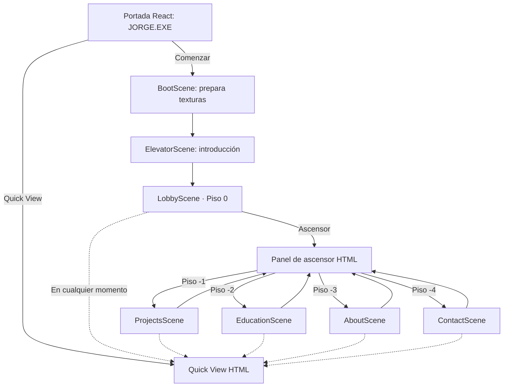

# Game Design Document — JORGE.EXE

**Versión:** MVP 1.0

**Género:** exploración narrativa 2D para web

**Duración objetivo:** 3–8 minutos para el recorrido principal; contenido opcional sin límite

**Perspectiva:** lateral, una sala compacta por piso

**Riesgo o derrota:** ninguno

## Fantasía del jugador

El visitante entra a Jorge Labs, un laboratorio subterráneo donde cada piso conserva una parte del trabajo y la historia de Jorge. No supera pruebas ni combate: observa, se acerca, conversa y abre expedientes. El ascensor convierte la navegación del portafolio en parte del mundo.

## Bucle principal

1. Explorar una sala.
2. Identificar un objeto por su silueta, luz o señal.
3. Acercarse hasta activar una indicación de interacción.
4. Interactuar y leer un diálogo breve.
5. Abrir, cuando corresponda, un panel con información profesional.
6. Volver al mundo o usar el ascensor para cambiar de piso.

No hay contenido obligatorio oculto detrás de habilidad motriz. El salto aporta sensación de juego y acceso a detalles opcionales, no bloquea proyectos, contacto ni educación.

## Mapa de escenas



### Responsabilidad por escena

| Escena | Objetivo | Contenido mínimo | Salida |
| --- | --- | --- | --- |
| `BootScene` | Generar/cargar texturas y registrar animaciones una vez | Indicador de carga accesible en React | Inicio o Lobby si se omite introducción |
| `ElevatorScene` | Mostrar descenso inicial o transición corta entre pisos | Cabina, indicador de piso, puertas | Piso elegido |
| `LobbyScene` | Enseñar movimiento e interacción sin tutorial largo | Robot, terminal, ascensor, señales, Quick View visible y punto de guardado decorativo | Ascensor |
| `ProjectsScene` | Probar capacidad de producto con evidencia | Vehículo CarDrive, estación SHIKO, módulo Comernova | Ficha de proyecto o ascensor |
| `EducationScene` | Comunicar formación e inglés | Terminal UEES, certificado C1, línea de tiempo/computadora | Diálogo o ascensor |
| `AboutScene` | Dar contexto humano y experiencia internacional | Laptop, ajedrez, mapa, maleta | Diálogo o ascensor |
| `ContactScene` | Cerrar el recorrido y facilitar acción | Computadora principal y panel de contacto | Contacto, Quick View o ascensor |

`ElevatorScene` puede ser una escena visual única y parametrizada; no debe duplicarse por destino. Las superposiciones de diálogo, proyecto, ascensor y Quick View son HTML/React, no escenas Phaser.

## Plano funcional de los pisos

Todas las salas usan una franja de suelo continua, límites laterales y cámara contenida. El orden espacial es guía, no escala final.

```text
Lobby       [Terminal]—[Robot]——[Jugador inicial]——[Ascensor]—[Guardado]
Proyectos   [CarDrive/garaje]——[SHIKO/paquetes]——[Comernova/estantes]—[Ascensor]
Educación   [UEES]——[Inglés C1]——[Línea de tiempo]——[Tecnologías]—[Ascensor]
Sobre mí    [Laptop]—[Ajedrez]——[Mapa Ecuador]——[Maleta 2025]—[Ascensor]
Contacto    [Ascensor]————————[Terminal principal de contacto]
```

Cada objeto esencial está a nivel del suelo y puede activarse sin saltar. Las capas decorativas no tienen colisión salvo que su forma lo comunique con claridad.

## Flujos de usuario

### Primera visita jugable

```mermaid
flowchart LR
  A["Portada"] --> B["Enter, clic o toque"]
  B --> C["Introducción breve u omitir"]
  C --> D["Lobby: señal de controles"]
  D --> E["Robot o terminal"]
  E --> F["Ascensor"]
  F --> G["Proyectos"]
  G --> H["CarDrive"]
  H --> I["Diálogo"]
  I --> J["Ficha accesible"]
  J --> K["Cerrar y recuperar control"]
```



### Visita rápida

`Portada → Quick View → Proyectos → CarDrive → Contacto/CV`.

Quick View también se abre desde cualquier piso. Al cerrarlo, el jugador vuelve al mismo lugar y estado.

### Interacción con proyecto

1. Phaser detecta el objeto más cercano y solicita mostrar `E / Enter · Interactuar`.
2. La acción de interacción abre un diálogo introductorio si existe.
3. React marca una superposición activa; Phaser congela al jugador y conserva su estado físico.
4. El visitante avanza el diálogo con Enter, clic, toque o el botón “Continuar”.
5. Al terminar, React sustituye el diálogo por la ficha sin desbloquear al jugador entre ambas vistas.
6. La ficha recibe foco inicial en su título o botón de cierre.
7. Escape, el botón “Cerrar” o el cierre programático devuelven el foco al elemento lógico previo y desbloquean el juego.

### Contacto

`Terminal → “Gracias por llegar hasta aquí.” → “Ahora sí.” → “Hablemos.” → panel de contacto`.

## Jugador y movimiento

- Cuerpo rectangular de Arcade Physics ajustado a la silueta, no al lienzo completo del sprite.
- Movimiento horizontal con aceleración corta y velocidad máxima consistente.
- Salto único; sin doble salto ni salto de pared.
- Gravedad y altura de salto moderadas; aterrizaje predecible.
- Cámara con seguimiento horizontal suave y límites de sala; sin temblor por subpíxeles.
- Animaciones mínimas: reposo, caminar y salto/caída.
- Al cambiar de dirección se refleja el sprite; no se duplican texturas.
- Al entrar a una escena, el personaje aparece en un `spawnId` seguro y nunca dentro de un collider.

Los valores exactos se afinan visualmente. Punto de partida recomendado a 60 FPS: velocidad horizontal máxima `180 px/s`, velocidad vertical inicial de salto `-360 px/s` y gravedad `900 px/s²`, escalados con el mundo y no con CSS.

## Interacciones

Cada objetivo implementa el siguiente contrato lógico:

```ts
type Interactable = {
  id: string;
  label: string;
  kind: "dialogue" | "project" | "elevator" | "contact";
  contentId?: string;
  position: { x: number; y: number };
  radius: number;
};
```

Reglas:

- Solo se enfoca un objetivo a la vez: el más cercano dentro del radio; en empate, el de menor `id` para conservar determinismo.
- La indicación desaparece al salir del radio, cambiar de escena o abrir una superposición.
- La interacción se dispara en el flanco de pulsación, nunca cada frame mientras una tecla permanece presionada.
- `E` y `Enter` son equivalentes en juego; Enter conserva su función de avance dentro del diálogo.
- Un objeto no abre más de una instancia de su diálogo o panel.

## Sistema de diálogos

### Estados

```text
cerrado → escribiendo → línea visible → siguiente línea → completado → cerrado
                     ↘ mostrar inmediatamente ↗
```

### Comportamiento

- Admite múltiples líneas, hablante y retrato opcionales.
- La primera acción durante escritura revela la línea completa; la siguiente avanza.
- Clic/toque sobre el diálogo y botón HTML “Continuar” son equivalentes a Enter.
- La velocidad se configura por diálogo y tiene un valor predeterminado.
- Con reducción de movimiento, el texto aparece completo sin efecto letra por letra.
- El sonido de escritura es opcional, original y no se reproduce si el audio está desactivado.
- El diálogo bloquea movimiento; al cerrarse devuelve control exactamente una vez.
- Los textos viven en datos tipados fuera de las escenas.

## Ascensor

El ascensor es el único navegador diegético entre pisos.

- La puerta es un objetivo interactivo normal.
- La interacción abre un panel HTML con los cinco pisos y marca el actual.
- El piso actual queda deshabilitado; los demás son botones reales.
- Al elegir destino, se cierra el panel, se conserva el bloqueo, se ejecuta una transición corta y se inicia la escena destino.
- Con movimiento reducido o “Omitir transiciones”, se hace un fundido breve o cambio inmediato.
- Escape cierra el menú sin viajar.
- El último destino no es progreso persistente; una recarga comienza en portada.

## Proyectos

### CarDrive — interacción de referencia

- **Objeto:** vehículo en garaje con terminal y documentos digitales.
- **Lectura visual:** verde/cian; luz puntual sobre el vehículo.
- **Preludio sugerido:** “Este prototipo administra algo más difícil que el código: vehículos, contratos y pagos reales.”
- **Resultado:** ficha con problema, funciones, tecnologías, estado, captura placeholder y acciones.

### SHIKO

- **Objeto:** paquetes, pantallas de anuncios y una gráfica de pedidos.
- **Lectura visual:** violeta/naranja.
- **Preludio sugerido:** “Aquí los pedidos y los anuncios intentan contar la misma historia.”
- **Estado visible:** diseño y arquitectura del MVP.

### Comernova

- **Objeto:** estanterías modulares en una habitación deliberadamente ordenada.
- **Lectura visual:** azul/ámbar.
- **Preludio sugerido:** “Cada producto tiene un lugar. El inventario también debería tenerlo.”
- **Estado visible:** en desarrollo.

## Interfaz sobre el juego

| Elemento | Regla |
| --- | --- |
| Indicación de interacción | Una línea, alto contraste, no tapa al personaje; anuncia cambios con `aria-live="polite"` fuera del canvas |
| Diálogo | Panel HTML inferior, ancho legible, foco controlado, botón “Continuar” |
| Ficha de proyecto | `dialog` modal con título, descripción, problema, funciones, tecnologías, estado, imagen y acciones |
| Menú de ascensor | Lista de botones con piso y nombre; piso actual deshabilitado |
| Quick View | Documento HTML desplazable; navegación por secciones y cierre persistente |
| Preferencias | Sonido, reducción de movimiento y omitir transiciones |
| Controles táctiles | Izquierda, derecha, salto, interactuar y menú; solo en dispositivo táctil o cuando se activan manualmente |

No se muestran vidas, experiencia ni puntuación en el MVP: sugerirían sistemas que no existen. El punto de guardado es decorativo y su diálogo declara que no guarda progreso.

## Controles

| Acción | Escritorio | Táctil |
| --- | --- | --- |
| Mover izquierda | `A` o `←` | Botón izquierda mantenido |
| Mover derecha | `D` o `→` | Botón derecha mantenido |
| Subir/contextual | `W` o `↑` | Acción contextual si aplica |
| Bajar/ascensor | `S` o `↓` | Menú/acción contextual |
| Saltar | `Espacio` | Botón salto |
| Interactuar/avanzar | `E` o `Enter` | Botón interactuar o toque en diálogo |
| Cerrar | `Escape` | Botón cerrar/menú |
| Quick View | Botón HTML persistente | Botón HTML persistente |

Los eventos de teclado se ignoran si el foco está en un campo, enlace o botón, excepto Escape para cerrar la superposición superior cuando corresponda.

## Cámara, resolución y responsive

- Resolución lógica objetivo: `1280 × 720` (16:9).
- Phaser usa `FIT` y `CENTER_BOTH`; el CSS conserva relación de aspecto y permite letterboxing.
- El mundo no se estira de forma independiente por eje.
- En móvil se reduce paralaje, partículas, luces decorativas y densidad de props.
- Los paneles HTML usan `max-height` dentro del viewport y scroll interno; nunca producen scroll horizontal.
- En orientación vertical el canvas puede ocupar una franja 16:9 y Quick View sigue disponible; no se obliga a rotar el dispositivo.
- La UI táctil respeta áreas seguras (`env(safe-area-inset-*)`).

## Dirección visual y audio

- Formas, SVG y texturas generadas originales durante el MVP.
- Fondos oscuros con contraste medido; verde, cian y violeta señalan zonas sin ser la única pista.
- Los objetos interactivos combinan iluminación, silueta y etiqueta contextual; el color no comunica por sí solo.
- Las luces CRT y partículas son decorativas y se desactivan con movimiento reducido.
- Sin música de terceros. El audio comienza desactivado y solo se habilita tras acción explícita.
- Los efectos deben ser breves, discretos y prescindibles para comprender una acción.

## Criterios de aceptación jugables

- **GDD-01:** Enter, clic o toque inicia la experiencia desde la portada.
- **GDD-02:** Omitir introducción lleva al Lobby sin dejar una transición o bloqueo activo.
- **GDD-03:** El personaje camina, salta, aterriza y no atraviesa el suelo ni los límites laterales.
- **GDD-04:** Al entrar en el radio de un objeto aparece una única indicación y al salir desaparece.
- **GDD-05:** `E`, Enter o el control táctil activan una interacción una sola vez por pulsación.
- **GDD-06:** Un diálogo admite varias líneas, revelado inmediato, avance y cierre con devolución de control.
- **GDD-07:** Abrir una superposición congela al jugador en suelo o aire; cerrarla restaura su estado y entrada.
- **GDD-08:** El ascensor permite visitar los cinco pisos y regresar al Lobby.
- **GDD-09:** CarDrive, SHIKO y Comernova abren fichas con datos distintos y estado correcto.
- **GDD-10:** Educación, Sobre mí y Contacto tienen al menos una interacción esencial accesible sin salto.
- **GDD-11:** Quick View abre desde portada y desde el juego, y al cerrarse conserva escena y posición.
- **GDD-12:** Los controles táctiles no cubren acciones críticas y desaparecen cuando no son necesarios.
- **GDD-13:** Con movimiento reducido no hay escritura letra por letra, parpadeo intenso ni transición prolongada.
- **GDD-14:** No existe información esencial disponible únicamente mediante exploración del canvas.
