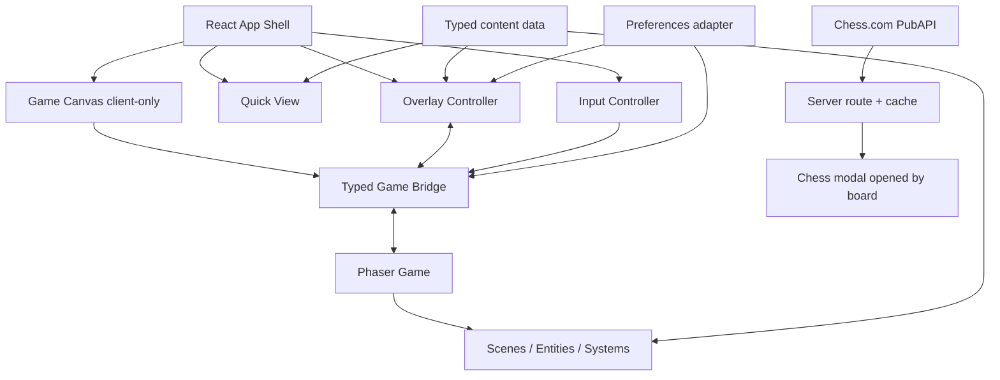
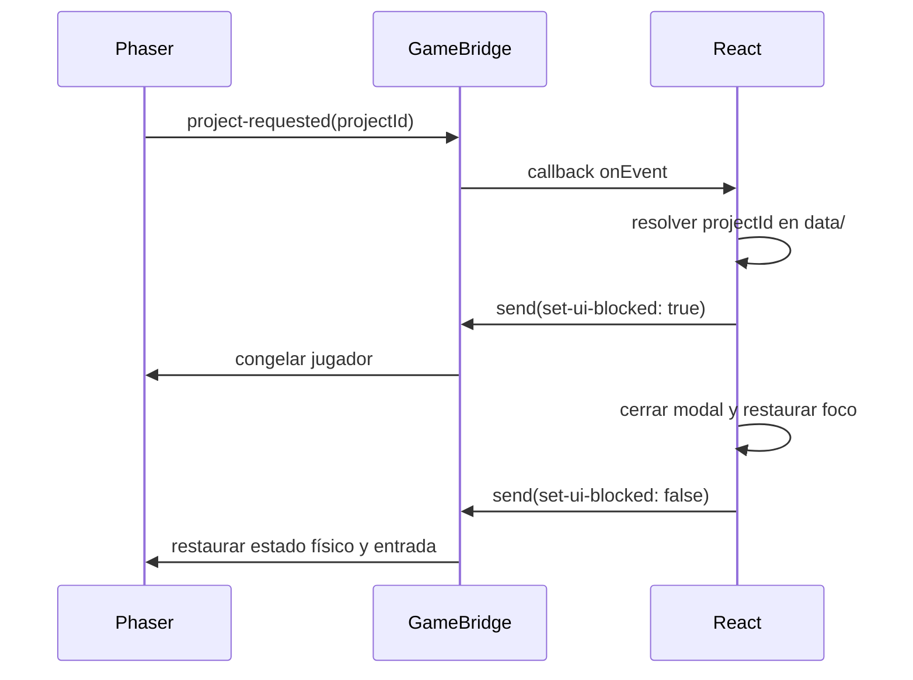

# Arquitectura técnica — Portafolio interactivo de Jorge Colamarco

**Estado:** arquitectura vigente del rediseño

**Arquitectura:** React + TypeScript + Vite/vinext + Phaser

**Principio:** React presenta y coordina; Phaser simula el mundo; los datos tipados son la fuente de verdad.

## Estado actual del repositorio

- Starter vinext `0.0.50` sobre Vite `8.0.13`.
- React/React DOM `19.2.6` y TypeScript `5.9.3` en modo estricto.
- Node.js requerido: `>=22.13.0`.
- Estructura App Router en `app/`; el proyecto no parte de un `src/` convencional.
- Phaser `3.90` está integrado como dependencia de producción y se carga dinámicamente en cliente.
- Build y desarrollo usan los scripts vinext existentes; la ruta Next nativa se conserva para Vercel.
- `app/api/chess/route.ts` consulta datos públicos de Chess.com para `jorcolito` con caché y fallback.

Por esta razón, el MVP conserva `app/` en la raíz y agrega módulos hermanos. Mover todo a `src/` no aporta valor y aumentaría el riesgo del starter.

## Decisiones arquitectónicas

1. **Phaser solo en cliente.** Nunca se importa desde un componente de servidor ni en el nivel superior de un módulo que pueda evaluar SSR.
2. **Una instancia de juego por montaje.** Abrir diálogos, modales, Quick View o preferencias no recrea Phaser.
3. **Puente tipado por instancia.** React y Phaser se comunican mediante un bridge sin dependencias de React ni Phaser, no mediante eventos globales de `window`.
4. **Estado con propietario único.** React no guarda posición o velocidad; Phaser no guarda el modal abierto ni el avance del diálogo.
5. **Contenido profesional compartido.** El juego y Quick View resuelven IDs contra los mismos objetos `readonly` tipados. Chess.com es una fuente externa aislada y opcional.
6. **Superposiciones exclusivas.** Solo una de `dialogue`, `project`, `library`, `elevator`, `chess`, `contact`, `quick-view` o `settings` está activa a la vez.
7. **HTML para información profesional.** Canvas dibuja el mundo; diálogos, fichas, navegación del elevador y Quick View son DOM semántico.
8. **Degradación segura.** Quick View y contacto siguen utilizables si falla la carga del juego.
9. **Datos externos detrás del servidor.** El navegador consume `/api/chess`; no conoce detalles de la PubAPI ni dispara varias solicitudes externas.

## Vista por capas



Las flechas desde datos son de solo lectura. Phaser emite intenciones con IDs; React resuelve y presenta el contenido.

## Estructura actual relevante

```text
app/
  api/chess/route.ts          # caché y fallback de Chess.com
  JorgeExeExperience.tsx     # raíz de cliente y estado UI
  layout.tsx
  page.tsx                    # shell de servidor mínimo
  globals.css
src/
  components/game/
    GameCanvas.tsx
    TouchControls.tsx
  components/ui/
    DialogueBox.tsx
    ProjectModal.tsx
    LibraryBookModal.tsx
    ChessModal.tsx
    ContactModal.tsx
    QuickView.tsx
  data/                       # proyectos, biblioteca, perfil y diálogos
  game/
    config/
    entities/
    events/GameBridge.ts
    scenes/                   # dioramas de Lobby, Proyectos e InfoFloor
    types/
  lib/chess-com.ts            # normalizador server-side
  types/                      # uniones y snapshots tipados
docs/
```

Las fronteras se mantienen por responsabilidad: React presenta, Phaser simula, `src/data` conserva hechos editoriales y `src/lib/chess-com.ts` normaliza una fuente pública no canónica.

## Frontera SSR/cliente

`app/page.tsx` renderiza el shell y un componente de cliente. `GameCanvas` crea Phaser dentro de `useEffect`:

```ts
useEffect(() => {
  let cancelled = false;
  let instance: PortfolioGameController | null = null;

  void import("../../game").then(({ createPortfolioGame }) => {
    if (cancelled || !hostRef.current) return;
    instance = createPortfolioGame({
      parent: hostRef.current,
      onEvent: (event) => eventHandlerRef.current?.(event),
    });
  });

  return () => {
    cancelled = true;
    instance?.destroy();
  };
}, []);
```

Requisitos:

- El controlador se conserva en `useRef` y no se recrea cuando cambian props de UI.
- `createPortfolioGame` y las escenas se importan dinámicamente desde un componente cliente.
- La promesa comprueba desmontaje antes de crear el juego.
- El cleanup destruye canvas, texturas, listeners y bridge; debe ser seguro si la carga no terminó.
- Fast Refresh no puede dejar dos canvas ni dos listeners de teclado.

## Modelo de contenido

```ts
export type ProjectId = "cardrive" | "shiko" | "comernova";

export type ResourceLink =
  | {
      availability: "available";
      href: string;
      label: string;
    }
  | {
      availability: "placeholder";
      href: null;
      label: string;
      placeholderMessage: string;
    };

export type Project = {
  id: ProjectId;
  name: string;
  summary: string;
  problem: string;
  features: readonly string[];
  technologies: readonly string[];
  status: string;
  visual: { alt: string; placeholderLabel: string };
  links: { demo: ResourceLink; repository: ResourceLink };
};
```

Los arreglos se declaran con `as const satisfies readonly Project[]`. Las escenas guardan `projectId`, nunca una copia del proyecto. Quick View construye sus secciones a partir de los mismos módulos.

Reglas de datos:

- Los IDs son estables, minúsculos y no dependen del texto visible.
- Los campos obligatorios no usan cadenas vacías.
- Un placeholder usa `href: null` y `availability: "placeholder"`; no usa `#`.
- Los datos no contienen JSX ni instancias Phaser.
- Las imágenes tienen texto alternativo o se marcan decorativas en el componente, no en la escena.
- Las listas se tratan como inmutables.

### Biblioteca académica

`EducationLibraryItem` distingue grado, resultado de idioma y formación cloud. La colección canónica contiene UEES, Cambridge C1 y `AWS Academy Data Engineering Trained`. El Statement of Results de Cambridge y la insignia de AWS Academy son recursos disponibles y conservan su denominación exacta; la segunda se modela editorialmente como formación completada, no como certificación profesional. La animación de libro y Quick View no mantienen inventarios separados.

### Chess.com

`app/api/chess/route.ts` llama en serie a estadísticas, lista de archivos y último archivo mensual para respetar los límites de la PubAPI. La respuesta se normaliza como `ChessSnapshot`:

- Rapid actual y récord solo cuando `chess_rapid` existe;
- máximo histórico de Tactics con esa etiqueta explícita;
- mejor Puzzle Rush como puntuación, no como rating;
- hasta cinco partidas recientes con campos opcionales saneados;
- estado `live`, `partial` o `unavailable`.

La ruta aplica caché de una hora, timeout por solicitud y siempre puede devolver un objeto de fallback sin cifras. No requiere API key, cookie ni secreto.

## Contrato explícito React–Phaser

### Transporte

`createPortfolioGame` devuelve un controlador por instancia. React envía una unión discriminada de comandos y Phaser responde mediante un callback de eventos; no existe un bus global ni una referencia en `window`.

```ts
export type ReactToGameCommand =
  | { type: "set-active"; active: boolean }
  | { type: "set-ui-blocked"; blocked: boolean }
  | { type: "set-reduced-motion"; reduced: boolean }
  | { type: "set-muted"; muted: boolean }
  | { type: "move"; direction: "left" | "right"; pressed: boolean }
  | { type: "jump" }
  | { type: "interact" }
  | { type: "select-floor"; floor: 0 | -1 | -2 | -3 | -4 };

export type GameToReactEvent =
  | { type: "ready"; floor: number }
  | { type: "floor-changed"; floor: number; label: string }
  | { type: "prompt-changed"; prompt: InteractionPrompt | null }
  | { type: "dialogue-requested"; dialogue: GameDialogue; after?: DialogueFollowUp }
  | { type: "elevator-requested"; currentFloor: number; floors: readonly FloorOption[] }
  | { type: "project-requested"; projectId: ProjectId }
  | { type: "quick-view-requested" }
  | { type: "chess-requested" }
  | { type: "contact-requested" };

export interface PortfolioGameController {
  send(command: ReactToGameCommand): void;
  focus(): void;
  destroy(): void;
}
```

### Dirección y efecto de eventos

| Evento | Emisor → receptor | Efecto permitido |
| --- | --- | --- |
| `set-ui-blocked` | React → Phaser | Bloquear o liberar entrada mientras existe una superposición |
| `move`, `jump`, `interact` | React → Phaser | Aplicar controles táctiles o imperativos normalizados |
| `select-floor` | React → Phaser | Cambiar a la escena del piso elegido |
| `set-reduced-motion`, `set-muted` | React → Phaser | Aplicar preferencias sin recrear el juego |
| `ready`, `floor-changed` | Phaser → React | Actualizar estado de carga y etiqueta de piso |
| `prompt-changed` | Phaser → React | Mostrar u ocultar la indicación accesible |
| `dialogue-requested` | Phaser → React | Abrir diálogo y, si corresponde, un libro posterior |
| `project-requested` | Phaser → React | Resolver el ID y abrir la ficha directamente |
| `elevator-requested` | Phaser → React | Abrir el menú HTML del elevador; puede originarse por `Q` desde cualquier piso |
| `quick-view-requested`, `contact-requested` | Phaser → React | Abrir la superposición HTML correspondiente |
| `chess-requested` | Phaser → React | Abrir el modal de Chess.com únicamente desde el tablero |

### Propiedad del estado

| Estado | Propietario | Proyección permitida |
| --- | --- | --- |
| Posición, velocidad, animación y escena activa | Phaser | React recibe solo `sceneId` y estados de carga |
| Objetivo cercano | Phaser | React muestra el prompt recibido; no recalcula distancias |
| Superposición activa y contenido seleccionado | React | Phaser recibe solo el modo para bloquear/desbloquear |
| Línea y progreso del diálogo | React | Phaser solo sabe que `mode !== "none"` |
| Preferencias de sonido/movimiento | React | Phaser aplica el último valor recibido |
| Datos profesionales | Módulos `data/` | React y Phaser leen por ID; ninguno los muta |
| Entrada | Phaser para teclado; React para controles táctiles | Ambos convergen en los mismos comandos y respetan el bloqueo de UI |

No se permite que Phaser abra DOM directamente, que React llame métodos de una escena, ni que un componente consulte `window.game`. Toda coordinación cruza el bridge.

### Secuencia directa de proyecto y bloqueo



`OverlayController` emite el nuevo modo desde una transición de estado única. Cuando diálogo conduce a proyecto, sustituye `dialogue → project` sin pasar por `none`.

## Bloqueo y restauración física

`PlayerLockSystem` es idempotente y trata toda superposición distinta de `none` como bloqueante.

Al bloquear:

1. guarda velocidad, dirección, estado de animación, `allowGravity` y `moves`;
2. limpia entrada activa para evitar movimiento acumulado;
3. fija velocidad a cero, desactiva gravedad y movimiento del cuerpo;
4. pausa la animación sin mover la posición.

Al desbloquear:

1. restaura flags físicos;
2. restaura la velocidad guardada si el jugador estaba en el aire; en suelo arranca desde cero;
3. reanuda o selecciona la animación correcta;
4. exige una nueva pulsación de interacción antes de volver a activar el objeto.

Con esto, un salto queda suspendido mientras el modal está abierto y continúa sin caída oculta al cerrarlo. Eventos repetidos con el mismo modo no generan snapshots nuevos ni liberaciones dobles.

## Entrada

React normaliza teclado y táctil con `useInputController`:

- registra listeners una vez y los elimina al desmontar;
- no intercepta teclas dentro de `input`, `textarea`, `select`, enlaces o botones;
- usa `preventDefault` solo para teclas de juego cuando el canvas está activo;
- emite `pressed: false` en `keyup`, `pointerup`, `pointercancel`, pérdida de foco y cambio de visibilidad;
- no emite entrada de juego si hay una superposición activa;
- Escape pertenece al controlador de superposiciones, no al movimiento;
- `Q` pertenece al acceso global del elevador y se registra junto con las teclas de juego para impedir scroll accidental;
- los botones táctiles usan Pointer Events y soportan presión mantenida.

## Escenas y sistemas

- `BootScene`: crea texturas con `Graphics`, registra animaciones y emite progreso; se ejecuta una vez.
- `ElevatorScene`: recibe origen/destino como datos y termina con `scene.start` del piso; el modal React representa la llegada y sus puertas.
- Cada piso declara geometría, colliders, spawns y `Interactable[]`; no implementa lógica de modal.
- `Player`: encapsula sprite, cuerpo y animaciones.
- `InteractionSystem`: calcula objetivo más cercano y emite cambios solo cuando cambia el ID.
- Las zonas de interacción también son clicables/táctiles y ejecutan la misma intención que `E`; su representación visual se ancla a objetos reales mediante contornos blancos pulsantes que se redibujan en verde cuando la zona queda activa.
- `PlayerLockSystem`: conserva/restaura estado sin pausar o recrear la escena completa.
- `TextureFactory`: genera assets originales de baja resolución y fija filtrado `NEAREST`.

Las escenas se suscriben a eventos mediante funciones de cleanup asociadas a `shutdown` y `destroy`. Cambiar de piso no acumula listeners.

## Estado de React

Una unión discriminada local en React es suficiente; no se añade una librería de estado en el MVP.

```ts
type OverlayState =
  | { type: "none" }
  | { type: "dialogue"; dialogue: GameDialogue; followUp?: DialogueFollowUp }
  | { type: "project"; projectId: ProjectId }
  | { type: "library"; itemId: string }
  | { type: "elevator"; currentFloor: PortfolioFloor; floors: readonly FloorOption[] }
  | { type: "chess" }
  | { type: "contact" }
  | { type: "quick-view" }
  | { type: "settings" };
```

Las preferencias pueden persistirse en `localStorage` bajo una clave versionada, por ejemplo `jorge-exe.preferences.v1`; el estado del juego no se persiste. Lectura y escritura se hacen solo en cliente y toleran almacenamiento bloqueado.

## Accesibilidad

- Portada, Quick View y overlays funcionan sin canvas.
- Cada modal usa `dialog` nativo cuando sea robusto o semántica `role="dialog"`, `aria-modal="true"`, título asociado, trampa de foco y restauración de foco.
- El prompt de interacción se refleja en una región `aria-live="polite"`; se evita anunciarlo en cada frame.
- El canvas tiene nombre accesible y descripción, pero no pretende representar su contenido completo.
- Existe enlace de salto a Quick View/contenido principal.
- Foco visible con contraste suficiente y tamaño táctil recomendado de al menos `44 × 44 CSS px`.
- `prefers-reduced-motion` inicializa la preferencia; el usuario puede sobrescribirla durante la sesión.
- Diálogo con movimiento reducido muestra cada línea completa.
- Las acciones placeholder están deshabilitadas con explicación visible; no son enlaces vacíos.

## Responsive y render

- Phaser configura escala `FIT`, centrado y resolución lógica `1280 × 720`.
- Un `ResizeObserver` del host solicita `game.scale.refresh()` sin recrear el juego.
- DPR se limita cuando sea necesario para evitar render costoso en móviles de alta densidad.
- El canvas usa `image-rendering: pixelated` y tamaño CSS independiente de la resolución lógica.
- Capas decorativas y partículas se reducen bajo breakpoint/capacidad; colisiones y contenido no cambian.
- Overlays pertenecen a una capa DOM sobre el host y se limitan con `100dvh` y safe areas.

## Rendimiento

- La portada y Quick View no esperan al chunk de Phaser.
- Phaser y escenas se cargan dinámicamente después de iniciar, o durante tiempo ocioso sin bloquear interacción.
- Primer mundo jugable: fondo de diorama y assets esenciales; los otros pisos pueden cargar al elegirlos.
- Presupuesto orientativo: menos de `450 KB gzip` de JavaScript antes del juego, chunk de juego menor a `550 KB gzip` y assets iniciales menores a `1.5 MB`.
- Objetivo práctico: 55–60 FPS en laptop y al menos 45 FPS estable en teléfono de gama media; bajar decoración antes que física o entrada.
- No usar videos, filtros de postprocesado caros, bucles DOM por frame ni render React a 60 FPS.
- `game:focus-changed` se emite solo al cambiar de objetivo, no continuamente.

## Fallos y recuperación

- Si falla la importación o inicialización de Phaser, React muestra un mensaje breve y botones para reintentar o abrir Quick View.
- Un `game:error` recuperable no desmonta el shell.
- IDs de contenido inexistentes producen un fallback seguro y diagnóstico en desarrollo; nunca un modal vacío.
- Enlaces placeholder no navegan.
- Un fallo o respuesta parcial de Chess.com mantiene el enlace público y omite las métricas ausentes.
- Ningún error se oculta con un `catch` vacío.

## Validación

### Automatizada

- TypeScript: contratos, discriminated unions y datos completos.
- Unitarias: selector de contenido, reducer de overlays, bridge subscribe/unsubscribe e `InteractionSystem` determinista.
- Componentes: foco/teclado de modal, Quick View y placeholders.
- Datos externos: normalización de Chess.com, timeout, respuesta parcial y fallback completo.
- Integración: evento de proyecto → diálogo → ficha → cierre; cambio de piso; cleanup del juego.
- Build: `npm run build`.
- Lint: `npm run lint`.
- Pruebas existentes: `npm test`.

### Manual

- Recorrido con teclado únicamente.
- Recorrido táctil y cancelación de puntero.
- Abrir modal en suelo y durante salto.
- Repetir apertura/cierre y cambio de piso al menos diez veces, buscando listeners o canvas duplicados.
- Probar ancho móvil, tablet y desktop; con reducción de movimiento y audio apagado.
- Revisar consola, orden de foco, scroll horizontal y controles fuera de viewport.

## Criterios de aceptación técnicos

- **TA-01:** Ningún módulo evaluado en servidor importa Phaser.
- **TA-02:** Montar y desmontar la experiencia crea y destruye exactamente una instancia y un canvas.
- **TA-03:** Juego y Quick View resuelven los tres proyectos desde `data/projects.ts`.
- **TA-04:** Todos los cruces React–Phaser usan eventos declarados en `EventMap`.
- **TA-05:** No existe referencia global a la instancia de juego ni llamada React → Scene.
- **TA-06:** Cambiar un overlay no reinicia escena, jugador ni cámara.
- **TA-07:** El bloqueo en aire conserva posición y restaura física al cerrar.
- **TA-08:** Cada suscripción devuelve cleanup y no aumenta tras cambios de escena.
- **TA-09:** Un fallo de Phaser deja Quick View y contacto operativos.
- **TA-10:** TypeScript, lint, build y pruebas existentes terminan sin errores antes de liberar.
- **TA-11:** Un fallo de Chess.com no rompe el modal del tablero ni expone números de respaldo inventados.
