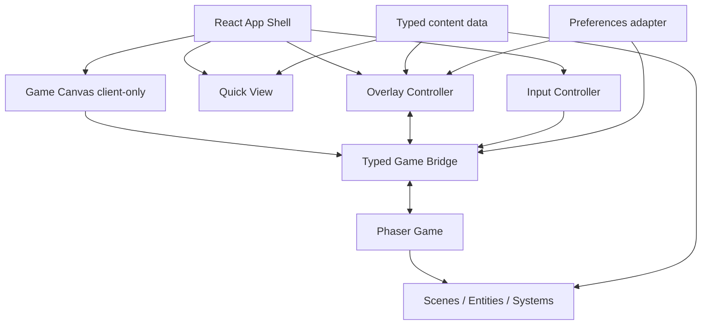

# Arquitectura técnica — JORGE.EXE

**Estado:** contrato objetivo del MVP

**Arquitectura:** React + TypeScript + Vite/vinext + Phaser

**Principio:** React presenta y coordina; Phaser simula el mundo; los datos tipados son la fuente de verdad.

## Estado del repositorio al definir esta arquitectura

- Starter vinext `0.0.50` sobre Vite `8.0.13`.
- React/React DOM `19.2.6` y TypeScript `5.9.3` en modo estricto.
- Node.js requerido: `>=22.13.0`.
- Estructura App Router en `app/`; el proyecto no parte de un `src/` convencional.
- Phaser todavía debe añadirse como dependencia de producción.
- Build y desarrollo usan los scripts vinext existentes.

Por esta razón, el MVP conserva `app/` en la raíz y agrega módulos hermanos. Mover todo a `src/` no aporta valor y aumentaría el riesgo del starter.

## Decisiones arquitectónicas

1. **Phaser solo en cliente.** Nunca se importa desde un componente de servidor ni en el nivel superior de un módulo que pueda evaluar SSR.
2. **Una instancia de juego por montaje.** Abrir diálogos, modales, Quick View o preferencias no recrea Phaser.
3. **Puente tipado por instancia.** React y Phaser se comunican mediante un bridge sin dependencias de React ni Phaser, no mediante eventos globales de `window`.
4. **Estado con propietario único.** React no guarda posición o velocidad; Phaser no guarda el modal abierto ni el avance del diálogo.
5. **Contenido estático compartido.** El juego y Quick View resuelven IDs contra los mismos objetos `readonly` tipados.
6. **Superposiciones exclusivas.** Solo una de `dialogue`, `project`, `elevator`, `contact`, `quick-view` o `settings` está activa a la vez.
7. **HTML para información profesional.** Canvas dibuja el mundo; diálogos, fichas, navegación de ascensor y Quick View son DOM semántico.
8. **Degradación segura.** Quick View y contacto siguen utilizables si falla la carga del juego.

## Vista por capas



Las flechas desde datos son de solo lectura. Phaser emite intenciones con IDs; React resuelve y presenta el contenido.

## Estructura objetivo

```text
app/
  layout.tsx
  page.tsx                    # shell de servidor mínimo
  globals.css
components/
  PortfolioExperience.tsx    # raíz de cliente y estado UI
  accessibility/
    SkipLinks.tsx
    VisuallyHiddenStatus.tsx
  game-ui/
    GameCanvas.tsx
    InteractionPrompt.tsx
    TouchControls.tsx
    SoundToggle.tsx
  modals/
    AccessibleDialog.tsx
    DialoguePanel.tsx
    ProjectModal.tsx
    ElevatorMenu.tsx
    ContactModal.tsx
  quick-view/
    QuickView.tsx
    QuickViewNav.tsx
data/
  projects.ts
  education.ts
  about.ts
  contact.ts
  dialogues.ts
  selectors.ts
game/
  config/
    createGameConfig.ts
  entities/
    Player.ts
  events/
    gameBridge.ts
    eventTypes.ts
  scenes/
    BootScene.ts
    ElevatorScene.ts
    LobbyScene.ts
    ProjectsScene.ts
    EducationScene.ts
    AboutScene.ts
    ContactScene.ts
  systems/
    InteractionSystem.ts
    PlayerLockSystem.ts
    TextureFactory.ts
  types/
    game.ts
hooks/
  useGameBridge.ts
  useInputController.ts
  useMediaPreferences.ts
styles/
  tokens.css
  overlays.css
types/
  content.ts
utils/
  assertNever.ts
docs/
```

Si la implementación agrupa componentes pequeños, debe conservar las fronteras de responsabilidad anteriores aunque cambie el nombre de un archivo.

## Frontera SSR/cliente

`app/page.tsx` renderiza el shell y un componente de cliente. `GameCanvas` crea Phaser dentro de `useEffect`:

```ts
useEffect(() => {
  let disposed = false;
  let game: Phaser.Game | undefined;

  void import("phaser").then(({ default: Phaser }) => {
    if (disposed || !hostRef.current) return;
    game = createPortfolioGame(Phaser, hostRef.current, bridge);
  });

  return () => {
    disposed = true;
    game?.destroy(true);
    bridge.dispose();
  };
}, [bridge]);
```

Requisitos:

- `bridge` se crea una sola vez con inicialización diferida de estado o `useRef`.
- `createPortfolioGame` y las escenas no se importan en un componente de servidor.
- La promesa comprueba desmontaje antes de crear el juego.
- El cleanup destruye canvas, texturas, listeners y bridge; debe ser seguro si la carga no terminó.
- Fast Refresh no puede dejar dos canvas ni dos listeners de teclado.

## Modelo de contenido

```ts
export type ProjectId = "cardrive" | "shiko" | "comernova";

export type ExternalLink = {
  label: string;
  href: string | null;
  status: "available" | "placeholder";
};

export type Project = {
  id: ProjectId;
  name: string;
  summary: string;
  problem: string;
  features: readonly string[];
  technologies: readonly string[];
  status: string;
  visual: { alt: string; placeholderLabel: string };
  links: { demo: ExternalLink; github: ExternalLink };
};
```

Los arreglos se declaran con `as const satisfies readonly Project[]`. Las escenas guardan `projectId`, nunca una copia del proyecto. `selectors.ts` construye las secciones de Quick View a partir de los mismos módulos.

Reglas de datos:

- Los IDs son estables, minúsculos y no dependen del texto visible.
- Los campos obligatorios no usan cadenas vacías.
- Un placeholder usa `href: null` y `status: "placeholder"`; no usa `#`.
- Los datos no contienen JSX ni instancias Phaser.
- Las imágenes tienen texto alternativo o se marcan decorativas en el componente, no en la escena.
- Las listas se tratan como inmutables.

## Contrato explícito React–Phaser

### Transporte

`GameBridge` es un emisor tipado, síncrono y por instancia. Puede implementarse con un pequeño mapa de listeners o un `EventTarget` envuelto. No añade una dependencia de estado global.

```ts
export interface EventMap {
  "ui:start-experience": { skipIntro: boolean };
  "ui:input": {
    action: "left" | "right" | "up" | "down" | "jump" | "interact";
    pressed: boolean;
    source: "keyboard" | "touch";
  };
  "ui:overlay-changed": {
    mode: "none" | "dialogue" | "project" | "elevator" | "contact" | "quick-view" | "settings";
  };
  "ui:travel-requested": {
    sceneId: "lobby" | "projects" | "education" | "about" | "contact";
    spawnId: "elevator" | "default";
  };
  "ui:preferences-changed": {
    soundEnabled: boolean;
    reducedMotion: boolean;
    skipTransitions: boolean;
  };
  "ui:destroy": undefined;

  "game:ready": { sceneId: string };
  "game:scene-changed": { sceneId: string; floor: 0 | -1 | -2 | -3 | -4 };
  "game:focus-changed": {
    target: null | { id: string; label: string };
  };
  "game:interaction-requested": {
    targetId: string;
    action:
      | { kind: "dialogue"; dialogueId: string }
      | { kind: "project"; projectId: ProjectId; preludeDialogueId?: string }
      | { kind: "elevator" }
      | { kind: "contact"; dialogueId: string };
  };
  "game:transition-changed": { active: boolean; label?: string };
  "game:error": { code: string; message: string; recoverable: boolean };
}

export interface GameBridge {
  emit<K extends keyof EventMap>(type: K, payload: EventMap[K]): void;
  on<K extends keyof EventMap>(
    type: K,
    listener: (payload: EventMap[K]) => void,
  ): () => void;
  dispose(): void;
}
```

### Dirección y efecto de eventos

| Evento | Emisor → receptor | Efecto permitido |
| --- | --- | --- |
| `ui:start-experience` | React → Phaser | Iniciar Boot/intro o ir directamente a Lobby |
| `ui:input` | React → Phaser | Actualizar entrada normalizada; ignorar si hay bloqueo |
| `ui:overlay-changed` | React → Phaser | Adquirir o liberar el único bloqueo de UI |
| `ui:travel-requested` | React → Phaser | Ejecutar transición y arrancar escena destino |
| `ui:preferences-changed` | React → Phaser | Ajustar animación y audio sin guardar otra preferencia |
| `ui:destroy` | React → Phaser | Retirar suscripciones antes de destruir el juego |
| `game:ready` | Phaser → React | Cambiar indicador de carga por canvas listo |
| `game:scene-changed` | Phaser → React | Actualizar etiqueta de piso; no controla la escena desde React |
| `game:focus-changed` | Phaser → React | Mostrar/ocultar indicación y anuncio accesible |
| `game:interaction-requested` | Phaser → React | Resolver IDs y abrir diálogo, ficha, ascensor o contacto |
| `game:transition-changed` | Phaser → React | Mostrar estado de carga y bloquear acciones redundantes |
| `game:error` | Phaser → React | Mostrar recuperación o acceso a Quick View y registrar diagnóstico |

### Propiedad del estado

| Estado | Propietario | Proyección permitida |
| --- | --- | --- |
| Posición, velocidad, animación y escena activa | Phaser | React recibe solo `sceneId` y estados de carga |
| Objetivo cercano | Phaser | React muestra el prompt recibido; no recalcula distancias |
| Superposición activa y contenido seleccionado | React | Phaser recibe solo el modo para bloquear/desbloquear |
| Línea y progreso del diálogo | React | Phaser solo sabe que `mode !== "none"` |
| Preferencias de sonido/movimiento | React | Phaser aplica el último valor recibido |
| Datos profesionales | Módulos `data/` | React y Phaser leen por ID; ninguno los muta |
| Entrada normalizada | React durante la pulsación | Phaser mantiene el estado necesario para su frame actual |

No se permite que Phaser abra DOM directamente, que React llame métodos de una escena, ni que un componente consulte `window.game`. Toda coordinación cruza el bridge.

### Secuencia de proyecto y bloqueo

```mermaid
sequenceDiagram
  participant G as Phaser
  participant B as GameBridge
  participant R as React
  G->>B: game:interaction-requested(projectId, prelude)
  B->>R: resolver IDs en data/
  R->>B: ui:overlay-changed(dialogue)
  B->>G: congelar jugador
  R->>R: avanzar diálogo
  R->>B: ui:overlay-changed(project)
  Note over G: continúa congelado; no hay frame desbloqueado
  R->>R: cerrar modal y restaurar foco
  R->>B: ui:overlay-changed(none)
  B->>G: restaurar estado físico y entrada
```

`OverlayController` emite el nuevo modo desde una transición de estado única. Cuando diálogo conduce a proyecto, sustituye `dialogue → project` sin pasar por `none`.

## Bloqueo y restauración física

`PlayerLockSystem` es idempotente y trata toda superposición distinta de `none` como bloqueante.

Al bloquear:

1. guarda velocidad, dirección, estado de animación, `allowGravity` y `moves`;
2. limpia entrada activa para evitar movimiento acumulado;
3. fija velocidad a cero, desactiva gravedad y movimiento del cuerpo;
4. pausa la animación sin mover la posición.

Al desbloquear:

1. restaura flags físicos;
2. restaura la velocidad guardada si el jugador estaba en el aire; en suelo arranca desde cero;
3. reanuda o selecciona la animación correcta;
4. exige una nueva pulsación de interacción antes de volver a activar el objeto.

Con esto, un salto queda suspendido mientras el modal está abierto y continúa sin caída oculta al cerrarlo. Eventos repetidos con el mismo modo no generan snapshots nuevos ni liberaciones dobles.

## Entrada

React normaliza teclado y táctil con `useInputController`:

- registra listeners una vez y los elimina al desmontar;
- no intercepta teclas dentro de `input`, `textarea`, `select`, enlaces o botones;
- usa `preventDefault` solo para teclas de juego cuando el canvas está activo;
- emite `pressed: false` en `keyup`, `pointerup`, `pointercancel`, pérdida de foco y cambio de visibilidad;
- no emite entrada de juego si hay una superposición activa;
- Escape pertenece al controlador de superposiciones, no al movimiento;
- los botones táctiles usan Pointer Events y soportan presión mantenida.

## Escenas y sistemas

- `BootScene`: crea texturas con `Graphics`, registra animaciones y emite progreso; se ejecuta una vez.
- `ElevatorScene`: recibe origen/destino como datos y termina con `scene.start` del piso.
- Cada piso declara geometría, colliders, spawns y `Interactable[]`; no implementa lógica de modal.
- `Player`: encapsula sprite, cuerpo y animaciones.
- `InteractionSystem`: calcula objetivo más cercano y emite cambios solo cuando cambia el ID.
- `PlayerLockSystem`: conserva/restaura estado sin pausar o recrear la escena completa.
- `TextureFactory`: genera assets originales de baja resolución y fija filtrado `NEAREST`.

Las escenas se suscriben a eventos mediante funciones de cleanup asociadas a `shutdown` y `destroy`. Cambiar de piso no acumula listeners.

## Estado de React

Un reducer local es suficiente; no se añade una librería de estado en el MVP.

```ts
type OverlayState =
  | { mode: "none" }
  | { mode: "dialogue"; dialogueId: string; next?: OverlayState }
  | { mode: "project"; projectId: ProjectId }
  | { mode: "elevator"; currentSceneId: string }
  | { mode: "contact" }
  | { mode: "quick-view"; returnFocusId?: string }
  | { mode: "settings" };
```

Las preferencias pueden persistirse en `localStorage` bajo una clave versionada, por ejemplo `jorge-exe.preferences.v1`; el estado del juego no se persiste. Lectura y escritura se hacen solo en cliente y toleran almacenamiento bloqueado.

## Accesibilidad

- Portada, Quick View y overlays funcionan sin canvas.
- Cada modal usa `dialog` nativo cuando sea robusto o semántica `role="dialog"`, `aria-modal="true"`, título asociado, trampa de foco y restauración de foco.
- El prompt de interacción se refleja en una región `aria-live="polite"`; se evita anunciarlo en cada frame.
- El canvas tiene nombre accesible y descripción, pero no pretende representar su contenido completo.
- Existe enlace de salto a Quick View/contenido principal.
- Foco visible con contraste suficiente y tamaño táctil recomendado de al menos `44 × 44 CSS px`.
- `prefers-reduced-motion` inicializa la preferencia; el usuario puede sobrescribirla durante la sesión.
- Diálogo con movimiento reducido muestra cada línea completa.
- Las acciones placeholder están deshabilitadas con explicación visible; no son enlaces vacíos.

## Responsive y render

- Phaser configura escala `FIT`, centrado y resolución lógica `1280 × 720`.
- Un `ResizeObserver` del host solicita `game.scale.refresh()` sin recrear el juego.
- DPR se limita cuando sea necesario para evitar render costoso en móviles de alta densidad.
- El canvas usa `image-rendering: pixelated` y tamaño CSS independiente de la resolución lógica.
- Capas decorativas y partículas se reducen bajo breakpoint/capacidad; colisiones y contenido no cambian.
- Overlays pertenecen a una capa DOM sobre el host y se limitan con `100dvh` y safe areas.

## Rendimiento

- La portada y Quick View no esperan al chunk de Phaser.
- Phaser y escenas se cargan dinámicamente después de iniciar, o durante tiempo ocioso sin bloquear interacción.
- Primer mundo jugable: texturas generadas y assets esenciales; los otros pisos pueden cargar al elegirlos.
- Presupuesto orientativo: menos de `450 KB gzip` de JavaScript antes del juego, chunk de juego menor a `550 KB gzip` y assets iniciales menores a `1.5 MB`.
- Objetivo práctico: 55–60 FPS en laptop y al menos 45 FPS estable en teléfono de gama media; bajar decoración antes que física o entrada.
- No usar videos, filtros de postprocesado caros, bucles DOM por frame ni render React a 60 FPS.
- `game:focus-changed` se emite solo al cambiar de objetivo, no continuamente.

## Fallos y recuperación

- Si falla la importación o inicialización de Phaser, React muestra un mensaje breve y botones para reintentar o abrir Quick View.
- Un `game:error` recuperable no desmonta el shell.
- IDs de contenido inexistentes producen un fallback seguro y diagnóstico en desarrollo; nunca un modal vacío.
- Enlaces placeholder no navegan.
- Ningún error se oculta con un `catch` vacío.

## Validación

### Automatizada

- TypeScript: contratos, discriminated unions y datos completos.
- Unitarias: selector de contenido, reducer de overlays, bridge subscribe/unsubscribe e `InteractionSystem` determinista.
- Componentes: foco/teclado de modal, Quick View y placeholders.
- Integración: evento de proyecto → diálogo → ficha → cierre; cambio de piso; cleanup del juego.
- Build: `npm run build`.
- Lint: `npm run lint`.
- Pruebas existentes: `npm test`.

### Manual

- Recorrido con teclado únicamente.
- Recorrido táctil y cancelación de puntero.
- Abrir modal en suelo y durante salto.
- Repetir apertura/cierre y cambio de piso al menos diez veces, buscando listeners o canvas duplicados.
- Probar ancho móvil, tablet y desktop; con reducción de movimiento y audio apagado.
- Revisar consola, orden de foco, scroll horizontal y controles fuera de viewport.

## Criterios de aceptación técnicos

- **TA-01:** Ningún módulo evaluado en servidor importa Phaser.
- **TA-02:** Montar y desmontar la experiencia crea y destruye exactamente una instancia y un canvas.
- **TA-03:** Juego y Quick View resuelven los tres proyectos desde `data/projects.ts`.
- **TA-04:** Todos los cruces React–Phaser usan eventos declarados en `EventMap`.
- **TA-05:** No existe referencia global a la instancia de juego ni llamada React → Scene.
- **TA-06:** Cambiar un overlay no reinicia escena, jugador ni cámara.
- **TA-07:** El bloqueo en aire conserva posición y restaura física al cerrar.
- **TA-08:** Cada suscripción devuelve cleanup y no aumenta tras cambios de escena.
- **TA-09:** Un fallo de Phaser deja Quick View y contacto operativos.
- **TA-10:** TypeScript, lint, build y pruebas existentes terminan sin errores antes de liberar.
